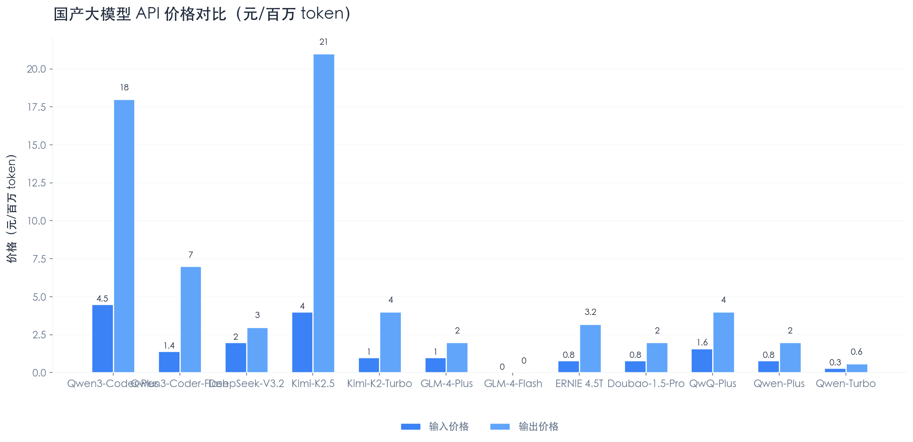
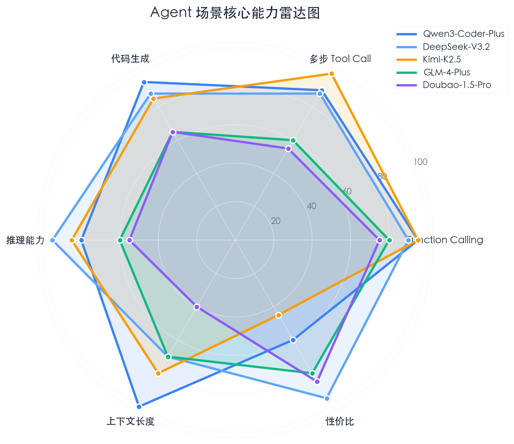

# 国产大模型 Agent 场景选型调研报告

> 面向 Agent 场景（tool call、长上下文、推理、代码生成），系统对比 6 大国产模型系列，给出选型建议。

**调研日期**：2026-03-28
**调研类型**：技术选型
**调研深度**：搜索 3 层，参考 20+ 个来源

---

## 摘要

本次调研覆盖阿里 Qwen、DeepSeek、智谱 GLM、百度 ERNIE、月之暗面 Kimi、字节豆包 6 大模型系列，聚焦 Agent 场景核心能力（function calling、长上下文、推理、代码生成）。核心发现：**Qwen3-Coder 系列和 Kimi-K2 系列在 Agent 场景综合能力最强**；DeepSeek-V3.2 性价比极高但上下文窗口较短；智谱 GLM-4 系列在免费额度方面有吸引力但输出 token 限制明显。建议 Agent 主力模型选 Qwen3-Coder-Plus 或 Kimi-K2.5，辅以 DeepSeek-V3.2 做高性价比兜底。

---

## 一、模型全景对比矩阵

### 1.1 基础规格对比

| 模型 | API Model ID | 上下文窗口 | 最大输出 | 输入价格 (元/百万token) | 输出价格 (元/百万token) | OpenAI 兼容 |
|------|-------------|-----------|---------|----------------------|----------------------|------------|
| **Qwen3-Coder-Plus** | `qwen3-coder-plus` | 1,000K | 65,536 | 4.5 | 18 | 是 |
| **Qwen3-Coder-Flash** | `qwen3-coder-flash` | 1,000K | 65,536 | 1.4 | 7 | 是 |
| **Qwen3-Max** | `qwen3-max` | 262K | 65,536 | 2.5~7 (分段) | 10~28 (分段) | 是 |
| **Qwen-Max** | `qwen-max` / `qwen-max-latest` | 131K | 16,384 | 2.4 | 9.6 | 是 |
| **Qwen-Plus** | `qwen-plus` / `qwen-plus-latest` | 131K | 16,384 | 0.8 | 2 | 是 |
| **Qwen-Turbo** | `qwen-turbo` / `qwen-turbo-latest` | 1,000K | 8,192 | 0.3 | 0.6 | 是 |
| **QwQ-Plus** | `qwq-plus` / `qwq-plus-latest` | 131K | 16,384 | 1.6 | 4 | 是 |
| **DeepSeek-V3.2 Chat** | `deepseek-chat` | 128K | 8,192 | 2 (miss) / 0.2 (hit) | 3 | 是 |
| **DeepSeek-V3.2 Reasoner** | `deepseek-reasoner` | 128K | 64K (含思考) | 2 (miss) / 0.2 (hit) | 3 | 是 |
| **GLM-4-Plus** | `glm-4-plus` | 128K | 4,096 | 1 (输入) | 2 (输出) | 是 |
| **GLM-4-Air** | `glm-4-air-250414` | 128K | 16,384 | 0.5 (输入) | 0.5 (输出) | 是 |
| **GLM-4-Flash** | `glm-4-flash-250414` | 128K | 16,384 | 免费 | 免费 | 是 |
| **ERNIE 4.5 Turbo** | `ernie-4.5-turbo` | 128K | 4,096 | 0.8 | 3.2 | 是 (千帆) |
| **ERNIE 4.0 Turbo** | `ernie-4.0-turbo-8k` | 8K (128K版另计) | 4,096 | 30 | 60 | 是 (千帆) |
| **Kimi-K2.5** | `kimi-k2.5` | 256K | 8,192 | 4 | 21 | 是 |
| **Kimi-K2-Thinking** | `kimi-k2-thinking` | 256K | 16,384 | 4 | 18 | 是 |
| **Kimi-K2-Turbo** | `kimi-k2-turbo-preview` | 256K | 8,192 | 1 | 4 | 是 |
| **Doubao-1.5-Pro** | `doubao-1.5-pro-32k` | 32K (pro-256k 可选) | 4,096 | 0.8 | 2 | 是 |
| **Doubao-1.5-Thinking-Pro** | `doubao-1.5-thinking-pro` | 128K | 16,384 | 4 | 16 | 是 |

> **价格说明**：DeepSeek 官方标价为美元，上表按约 7.2 汇率折算人民币；Kimi 部分价格同理折算；分段计价模型取基础段价格。实际账单以官方为准。

### 1.2 Agent 核心能力对比

| 模型 | Function Calling | Thinking 模式 | Vision | JSON Mode | 多步 Tool Call | 代码生成 |
|------|:----------------:|:-------------:|:------:|:---------:|:-------------:|:--------:|
| **Qwen3-Coder-Plus** | 强 | 支持 | 否 | 支持 | 强 (多轮稳定) | 极强 |
| **Qwen3-Coder-Flash** | 强 | 支持 | 否 | 支持 | 强 | 强 |
| **Qwen3-Max** | 强 | 支持 | 支持 | 支持 | 强 | 强 |
| **Qwen-Plus** | 强 | 支持 | 否 | 支持 | 中 | 中 |
| **QwQ-Plus** | 中 | 始终开启 | 否 | 支持 | 中 | 中 |
| **DeepSeek-V3.2 Chat** | 强 | 可选开启 | 否 | 支持 | 强 | 强 |
| **DeepSeek-V3.2 Reasoner** | 强 | 始终开启 | 否 | 支持 | 强 | 强 |
| **GLM-4-Plus** | 强 | 否 | 否 | 支持 | 中 | 中 |
| **GLM-4-Air** | 强 | 否 | 否 | 支持 | 中 | 中 |
| **GLM-4-Flash** | 强 | 否 | 否 | 支持 | 弱 | 弱 |
| **ERNIE 4.5 Turbo** | 支持 | 否 | 支持 | 支持 | 弱 | 中 |
| **ERNIE 4.0 Turbo** | 支持 | 否 | 否 | 支持 | 弱 | 中 |
| **Kimi-K2.5** | 强 | 支持 | 支持 | 支持 | 极强 (300步) | 强 |
| **Kimi-K2-Thinking** | 强 | 始终开启 | 否 | 支持 | 极强 (300步) | 强 |
| **Doubao-1.5-Pro** | 强 | 否 | 否 | 支持 | 中 | 中 |
| **Doubao-1.5-Thinking-Pro** | 中 | 始终开启 | 否 | 支持 | 中 | 中 |

---

## 二、各模型系列详细分析

### 2.1 Qwen 系列（阿里通义千问）

**平台**：阿里云百炼 (Model Studio) — `https://dashscope.aliyuncs.com/compatible-mode/v1`

**Agent 场景推荐梯队**：

| 推荐等级 | 模型 | 场景 |
|---------|------|------|
| 首选 | Qwen3-Coder-Plus | 复杂 Agent 编码任务、多步 tool call、仓库级代码理解 |
| 性价比 | Qwen3-Coder-Flash | 日常编码 Agent、成本敏感场景 |
| 通用 | Qwen3-Max | 需要视觉能力 + 编码 + 推理的综合 Agent |
| 轻量 | Qwen-Plus | 简单 Agent 对话、成本优先 |
| 推理专用 | QwQ-Plus | 数学/逻辑推理密集型任务 |
| 速度优先 | Qwen-Turbo | 高并发、低延迟、简单任务 |

**Agent 优势**[^1][^2]：
- Qwen3-Coder 系列专为 Agent 编码场景设计，**多轮 tool call 稳定性业界领先**
- 1M token 上下文窗口，可处理超大代码仓库
- 全系列兼容 OpenAI API 格式，迁移成本极低
- 阶梯定价机制（0~32K / 32K~128K / 128K+ 三档），短对话更便宜
- 支持 context caching，重复前缀场景成本可降 50%~90%

**Agent 劣势**：
- Qwen3-Coder 不支持 vision，需配合 Qwen3-VL 或 Qwen3-Max 处理图像
- QwQ-Plus 的 thinking 模式不可关闭，简单任务会浪费 token
- 阶梯定价在长上下文场景下价格攀升明显

---

### 2.2 DeepSeek 系列

**平台**：DeepSeek 官方 API — `https://api.deepseek.com/v1`

**Agent 场景推荐**：

| 推荐等级 | 模型 | 场景 |
|---------|------|------|
| 通用首选 | deepseek-chat (V3.2) | 非思考模式下的 Agent 编码和工具调用 |
| 推理任务 | deepseek-reasoner (V3.2) | 需要深度推理的复杂 Agent 决策 |

**Agent 优势**[^3][^4]：
- **性价比极高**：缓存命中时输入仅 0.2 元/百万 token，是国产模型中最便宜的旗舰级选项
- V3.2 统一了 chat 和 reasoner，同一模型支持思考/非思考双模式
- V3.2 是**首个将 thinking 集成到 tool-use 中的模型**，Agent 推理+工具调用一体化
- 完全兼容 OpenAI API 格式
- 90% 缓存折扣，Agent 多轮对话场景天然受益

**Agent 劣势**：
- **不支持 vision**，无法处理图像输入
- 上下文窗口 128K，低于 Qwen 的 1M 和 Kimi 的 256K
- 非思考模式最大输出仅 8K token，复杂代码生成可能不够
- 服务稳定性历史上有波动（高峰期限流）
- 国内部署可能存在合规风险（需关注政策动态）

---

### 2.3 智谱 GLM 系列

**平台**：智谱 AI 开放平台 — `https://open.bigmodel.cn/api/paas/v4`

**Agent 场景推荐**：

| 推荐等级 | 模型 | 场景 |
|---------|------|------|
| 旗舰 | GLM-4-Plus | 对话质量要求高、中等复杂度 Agent |
| 性价比 | GLM-4-Air | 日常 Agent 对话、成本敏感 |
| 免费试用 | GLM-4-Flash | 开发调试、低成本实验 |

**Agent 优势**[^5][^6]：
- GLM-4-Flash **完全免费**，开发阶段零成本
- 全系列支持 Function Calling 和 MCP 协议
- 支持 JSON Mode 结构化输出
- 兼容 OpenAI API 格式
- GLM-4-Plus 中文理解能力强，接近 GPT-4o 水平

**Agent 劣势**：
- **GLM-4-Plus 最大输出仅 4,096 token**，严重限制代码生成和长文本任务
- 缺乏 thinking/推理模式，复杂推理能力不足
- 缺少专门的编码模型
- GLM-4-AirX 上下文仅 8K，不适合 Agent 场景
- 模型更新节奏慢于 Qwen 和 DeepSeek

---

### 2.4 百度文心 ERNIE 系列

**平台**：百度千帆大模型平台 — `https://aip.baidubce.com`

**Agent 场景推荐**：

| 推荐等级 | 模型 | 场景 |
|---------|------|------|
| 通用 | ERNIE 4.5 Turbo | 综合 Agent 任务、中文对话 |
| 旧版旗舰 | ERNIE 4.0 Turbo | 需要极高质量输出（但成本高） |

**Agent 优势**[^7]：
- ERNIE 4.5 Turbo 性价比较好（输入 0.8 元/百万 token）
- 中文理解能力强（C-Eval 86.2 分）
- 支持 Function Calling 和百度搜索插件集成
- 千帆平台兼容 OpenAI SDK 格式
- ERNIE 4.5 支持多模态（文本+图像）

**Agent 劣势**：
- **ERNIE 4.0 Turbo 极其昂贵**（输入 30 元、输出 60 元/百万 token），不适合高频 Agent 场景
- 最大输出仅 4,096 token，代码生成受限
- 多步 tool call 能力弱于 Qwen 和 Kimi
- 模型版本较多但命名混乱，选型成本高
- Agent 生态和社区支持弱于竞品
- 2026 年推出 ERNIE 5.0，但 API 定价和 Agent 能力数据尚不充分

---

### 2.5 Kimi-K2 系列（月之暗面）

**平台**：Moonshot AI 开放平台 — `https://api.moonshot.cn/v1`

**Agent 场景推荐**：

| 推荐等级 | 模型 | 场景 |
|---------|------|------|
| 旗舰多模态 | kimi-k2.5 | 需要视觉+编码+Agent 的综合场景 |
| 推理 Agent | kimi-k2-thinking | 深度推理、复杂多步 Agent |
| 性价比 | kimi-k2-turbo-preview | 日常 Agent 任务、速度优先 |

**Agent 优势**[^8][^9]：
- **多步 tool call 支持最多 300 步**，在超长 Agent 链路中表现最佳
- Kimi-K2.5 原生多模态，同时支持视觉理解 + 编码 + Agent
- 256K 上下文窗口，平衡了成本和容量
- 支持 Agent 集群协作模式（多 Agent 协同）
- 自动 75% 上下文缓存折扣
- tool call **接近 100% 准确率**（官方数据）
- 兼容 OpenAI API 格式

**Agent 劣势**：
- 价格偏高：K2.5 输出 21 元/百万 token，是 DeepSeek 的 7 倍
- 1T 总参数、32B 激活参数的 MoE 架构，推理延迟可能较高
- 国内社区和生态不如 Qwen
- 免费额度有限

---

### 2.6 字节豆包 Doubao 系列

**平台**：火山引擎方舟 (Ark) — `https://ark.cn-beijing.volces.com/api/v3`

**Agent 场景推荐**：

| 推荐等级 | 模型 | 场景 |
|---------|------|------|
| 通用 | doubao-1.5-pro-32k | 日常 Agent 对话、简单工具调用 |
| 推理 | doubao-1.5-thinking-pro | 需要推理的 Agent 场景 |

**Agent 优势**[^10]：
- 价格极低：Pro-32K 输入仅 0.8 元、输出 2 元/百万 token
- 稀疏 MoE 架构，推理效率高
- 支持 Function Calling 和 OpenAI API 兼容
- 火山引擎基础设施稳定
- 字节生态加持（豆包 App 用户量大）

**Agent 劣势**：
- **默认上下文仅 32K**，pro-256k 版本价格翻倍
- 最大输出 4,096 token，严重限制代码生成
- Agent 生态和编码能力弱于 Qwen、DeepSeek
- 缺少专用编码模型（Doubao-Seed-Code 刚发布，数据不足）
- 火山方舟的 endpoint 管理较复杂（需要先创建推理接入点）

---

## 三、Agent 场景选型决策

### 3.1 场景-模型推荐矩阵

| Agent 场景 | 首选 | 备选 | 不推荐 |
|-----------|------|------|--------|
| **编码 Agent**（代码生成/重构/review） | Qwen3-Coder-Plus | DeepSeek-V3.2, Kimi-K2.5 | GLM-4-Flash, ERNIE |
| **多步工具调用**（复杂 Agent 链路） | Kimi-K2-Thinking | Qwen3-Coder-Plus, DeepSeek-V3.2 | GLM-4, Doubao |
| **深度推理**（数学/逻辑/分析） | DeepSeek-V3.2 Reasoner | QwQ-Plus, Kimi-K2-Thinking | ERNIE, GLM-4 |
| **多模态 Agent**（需要看图） | Kimi-K2.5 | Qwen3-Max | DeepSeek, Doubao |
| **高性价比**（成本优先） | DeepSeek-V3.2 | Qwen-Plus, Doubao-1.5-Pro | Kimi-K2.5, ERNIE-4.0 |
| **免费开发/调试** | GLM-4-Flash | Qwen-Turbo (有免费额度) | — |
| **超长上下文**（大代码仓库） | Qwen3-Coder-Plus (1M) | Kimi-K2.5 (256K) | GLM-4-AirX (8K) |
| **低延迟**（实时交互） | Qwen-Turbo | Doubao-1.5-Pro, GLM-4-AirX | DeepSeek-Reasoner |

### 3.2 CCCLaw 项目推荐方案

基于 CCCLaw 项目目标（国产模型 + Agent 工程能力对齐 Claude Code 体验），推荐以下模型组合：

```
主力模型（编码 Agent）：Qwen3-Coder-Plus
  理由：1M 上下文、多轮 tool call 稳定、专为 Agent 编码设计

推理模型（复杂决策）：DeepSeek-V3.2 Reasoner
  理由：thinking + tool-use 一体化、性价比极高

快速模型（轻量任务）：Qwen-Turbo 或 Qwen3-Coder-Flash
  理由：低成本低延迟、1M 上下文

兜底免费模型（开发调试）：GLM-4-Flash
  理由：完全免费、支持 Function Calling
```

### 3.3 关键决策因素

**选 Qwen3-Coder-Plus 而非 Kimi-K2.5 的理由**：
1. 上下文窗口 1M vs 256K，处理大仓库优势明显
2. 阿里云生态更成熟，API 稳定性更有保障
3. 国内社区资源和文档最丰富
4. 价格更合理（输入 4.5 vs 4 元差距不大，但输出 18 vs 21 元 Qwen 更便宜）

**选 DeepSeek-V3.2 做推理兜底的理由**：
1. 缓存命中价格仅 0.2 元/百万 token，多轮 Agent 对话几乎无成本
2. 唯一实现 thinking + tool-use 深度融合的模型
3. OpenAI API 完全兼容，切换成本为零

---

## 四、API 兼容性总结

所有调研模型均声称兼容 OpenAI API 格式，具体兼容程度：

| 平台 | 兼容方式 | Base URL | 备注 |
|------|---------|----------|------|
| 阿里百炼 | 原生兼容 OpenAI SDK | `https://dashscope.aliyuncs.com/compatible-mode/v1` | 最完整的兼容实现 |
| DeepSeek | 原生兼容 OpenAI SDK | `https://api.deepseek.com/v1` | 接口一致，直接替换 |
| 智谱 | 兼容 OpenAI SDK | `https://open.bigmodel.cn/api/paas/v4` | 部分参数名不同 |
| 百度千帆 | 适配 OpenAI SDK | `https://aip.baidubce.com` | 需要额外的鉴权配置 |
| Moonshot | 兼容 OpenAI SDK | `https://api.moonshot.cn/v1` | 基本一致 |
| 火山方舟 | 兼容 OpenAI SDK | `https://ark.cn-beijing.volces.com/api/v3` | 需要先创建 endpoint |

---

## 五、价格可视化





> 雷达图评分说明：各维度按 0-100 打分，综合官方文档、社区评测和第三方 benchmark 数据。性价比维度综合考虑价格和能力的比值。

### 5.1 主力模型输入价格对比（元/百万 token）

```
DeepSeek-V3.2 (缓存命中)  ████ 0.2
Qwen-Turbo                 ██████ 0.3
GLM-4-Air                  ██████████ 0.5
Doubao-1.5-Pro             ████████████████ 0.8
ERNIE 4.5 Turbo            ████████████████ 0.8
Qwen-Plus                  ████████████████ 0.8
GLM-4-Plus                 ████████████████████ 1.0
Kimi-K2-Turbo              ████████████████████ 1.0
QwQ-Plus                   ████████████████████████████████ 1.6
DeepSeek-V3.2 (缓存未命中) ████████████████████████████████████████ 2.0
Qwen-Max                   ████████████████████████████████████████████████ 2.4
Kimi-K2.5 / K2-Thinking    ████████████████████████████████████████████████████████████████████████████████████ 4.0
Qwen3-Coder-Plus           ██████████████████████████████████████████████████████████████████████████████████████████████ 4.5
```

### 5.2 主力模型输出价格对比（元/百万 token）

```
Qwen-Turbo                 █ 0.6
Qwen-Plus                  ████ 2.0
Doubao-1.5-Pro             ████ 2.0
GLM-4-Plus                 ████ 2.0
DeepSeek-V3.2              ██████ 3.0
ERNIE 4.5 Turbo            ██████ 3.2
Kimi-K2-Turbo              ████████ 4.0
QwQ-Plus                   ████████ 4.0
Qwen3-Coder-Flash          ██████████████ 7.0
Qwen-Max                   ████████████████████ 9.6
Qwen3-Max                  ████████████████████ 10.0
Doubao-1.5-Thinking-Pro    ████████████████████████████████ 16.0
Kimi-K2-Thinking           ████████████████████████████████████████████████████████████████████████████ 18.0
Qwen3-Coder-Plus           ████████████████████████████████████████████████████████████████████████████ 18.0
Kimi-K2.5                  ██████████████████████████████████████████████████████████████████████████████████████ 21.0
```

---

## 结论与建议

### 核心结论

1. **Qwen3-Coder-Plus 是当前国产模型中 Agent 编码场景的最佳选择**：1M 上下文 + 专门的多轮 tool call 优化 + 阿里云生态支撑，综合能力最强[^1][^2]
2. **DeepSeek-V3.2 在性价比和推理-工具融合方面独树一帜**：缓存命中 0.2 元的价格、thinking + tool-use 一体化，是 Agent 推理场景的最优解[^3][^4]
3. **Kimi-K2 系列在多步 Agent 和多模态方面有独特优势**：300 步 tool call、原生视觉 + 编码融合，适合超复杂 Agent 链路[^8][^9]
4. **GLM-4-Flash 是免费开发调试的最佳选择**：完全免费 + Function Calling + JSON Mode，开发阶段零成本[^5]
5. **ERNIE 和 Doubao 在 Agent 场景整体偏弱**：输出 token 限制（4K）和多步 tool call 能力不足是主要短板

### 行动建议

1. **立即可做**：接入 Qwen3-Coder-Plus 作为 CCCLaw 主力编码 Agent 模型，同时配置 DeepSeek-V3.2 作为推理兜底
2. **短期优化**：实现模型路由机制，根据任务复杂度自动选择模型（简单任务走 Qwen-Turbo，复杂编码走 Coder-Plus，推理走 DeepSeek Reasoner）
3. **持续关注**：DeepSeek-V4（已有早期信息）、Kimi-K2.5 后续版本、Qwen3.5 系列的发布动态

### 未覆盖的问题

- 各模型在真实 Agent 链路中的端到端延迟实测（需要 benchmark）
- 各平台的 API 可用性 SLA 和限流策略对比
- 模型在特定领域（如法律文本理解）的专项表现
- MiniMax M2 / 腾讯混元等其他国产模型的 Agent 能力

---

## 参考资料

### 官方文档

1. [阿里云百炼模型列表](https://help.aliyun.com/zh/model-studio/models) — Qwen 全系列模型规格
2. [阿里云百炼模型价格](https://help.aliyun.com/zh/model-studio/model-pricing) — Qwen 定价详情
3. [Qwen-Coder 模型能力文档](https://help.aliyun.com/zh/model-studio/qwen-coder) — Qwen3-Coder 系列能力说明
4. [DeepSeek API Models & Pricing](https://api-docs.deepseek.com/quick_start/pricing) — DeepSeek 官方定价
5. [DeepSeek-V3.2 Release Notes](https://api-docs.deepseek.com/news/news251201) — V3.2 发布说明
6. [智谱 GLM-4 模型文档](https://docs.bigmodel.cn/cn/guide/models/text/glm-4) — GLM-4 系列规格
7. [智谱 AI 开放平台定价](https://bigmodel.cn/pricing) — GLM 系列价格
8. [Kimi API 定价说明](https://platform.moonshot.cn/docs/pricing/chat) — Kimi K2 系列价格
9. [Kimi K2 快速开始](https://platform.moonshot.cn/docs/guide/kimi-k2-quickstart) — K2 系列技术文档
10. [火山引擎模型价格](https://www.volcengine.com/docs/82379/1544106) — 豆包系列定价
11. [百度千帆模型计费](https://cloud.baidu.com/doc/qianfan/s/wmh4sv6ya) — ERNIE 系列定价

### 技术博客与社区

12. [2026 年国内 AI 大模型 API 价格对比](https://makeronsite.com/2026-china-ai-model-api-price-comparison.html) — 综合价格对比分析
13. [Kimi K2.5 Complete Guide](https://www.codecademy.com/article/kimi-k-2-5-complete-guide-to-moonshots-ai-model) — K2.5 能力详解
14. [DeepSeek API Pricing Guide 2026](https://www.nxcode.io/resources/news/deepseek-api-pricing-complete-guide-2026) — DeepSeek 2026 定价指南
15. [Qwen3 Coder Plus vs Flash](https://blog.galaxy.ai/compare/qwen3-coder-flash-vs-qwen3-coder-plus) — Coder 系列对比
16. [OpenRouter Kimi K2.5](https://openrouter.ai/moonshotai/kimi-k2.5) — K2.5 第三方定价参考

---

[^1]: 阿里云百炼文档，Qwen3-Coder 系列支持多轮 tool call 和仓库级代码理解
[^2]: Qwen3 Coder Plus 在 OpenRouter 等第三方平台的评测数据
[^3]: DeepSeek API 官方定价页面，V3.2 统一了 chat 和 reasoner
[^4]: DeepSeek-V3.2 发布说明，首个将 thinking 集成到 tool-use 的模型
[^5]: 智谱 GLM-4 文档，全系列支持 Function Calling 和 MCP
[^6]: 智谱 AI 定价页面，GLM-4-Flash 免费使用
[^7]: 百度千帆平台文档，ERNIE 4.5 Turbo 定价和能力说明
[^8]: Kimi K2 GitHub 仓库，1T 参数 MoE 架构，32B 激活参数
[^9]: Moonshot AI 平台文档，K2-Thinking 支持 300 步 tool call
[^10]: 火山引擎文档，Doubao-1.5-Pro 定价和功能说明
